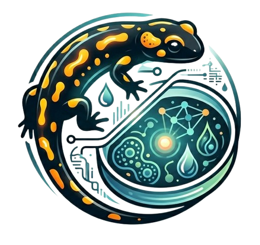

# Oezys project
<div align="center">
    
</div>

A HackKošice 2026 project about developing a disease detection software utilizing the teardrop crystal data. Currently implementing an ensemble of various models to test their detection capabilities.

## Used models

- *Finetuned ResNet18*
- *Custom CNN*
- *RandomForest method*

## Techstack

- `Weights and Biases`
- `Pytorch Lightning`
- `Albumentations`
- `timm`
- `invoke`

## Instalation

```bash
python3 -m venv env
source env/bin/activate
pip install -r requirements.txt
```

## TODO

- [x] Finish Dataloader
- [x] Finish Dataset
- [x] Integrate invoke
- [x] Integrate andri's cooking
- [x] Set ResNet18 for train
- [x] Utilize Weights and Biases
- [x] Wire Data inspector to validate train data
- [x] Setup Model API that will be called by App
- [x] Finish augmentations
- [x] Send to GPU
- [x] Add debug info in vscode
- [x] Rewire all to andri's new data preprocessing
- [x] Start drawing out pipeline
- [x] ML + DL ensemble MoE
- [ ] Debug MoE because it is not really functional right now
